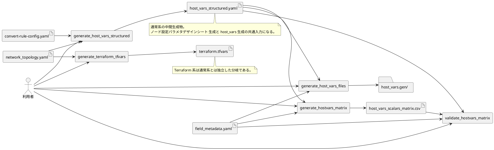
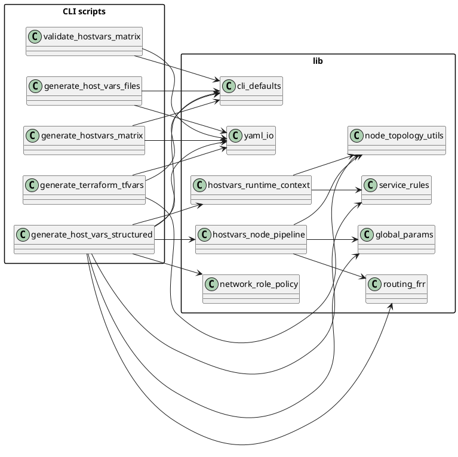
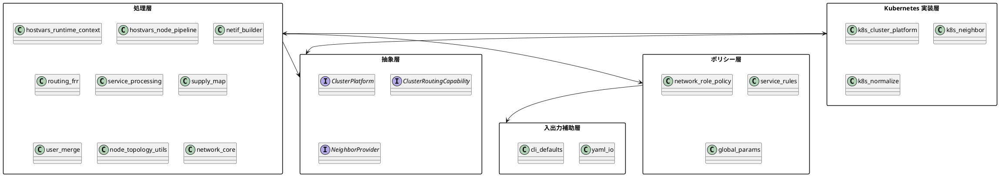
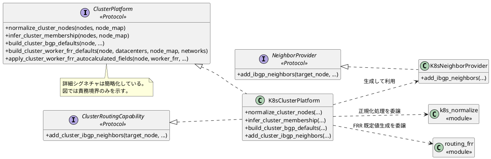
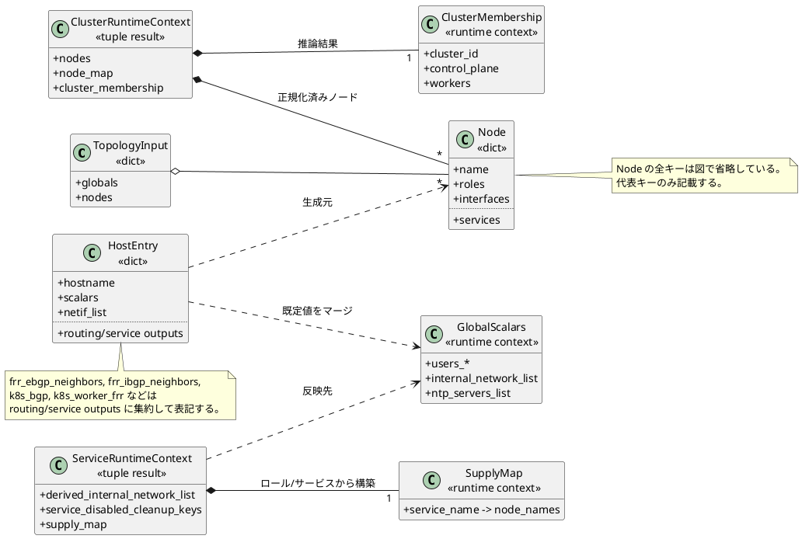
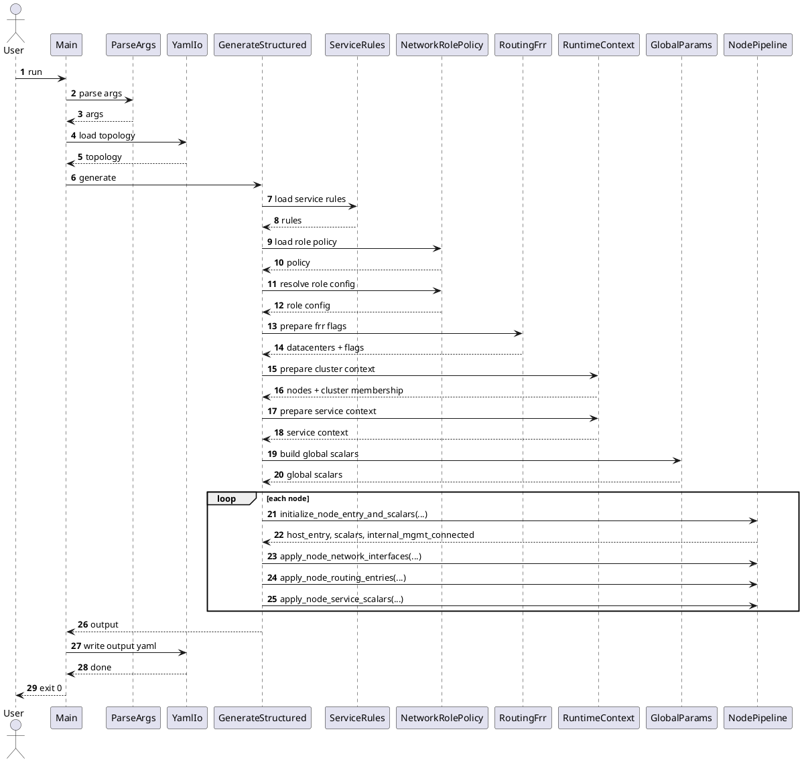
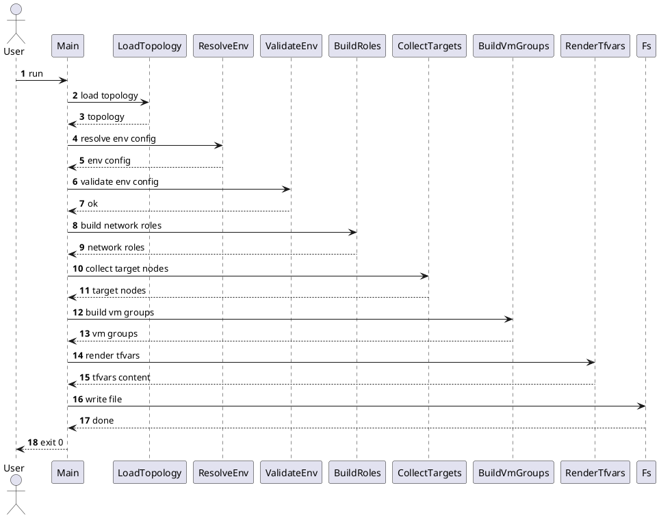

# src/prototype プログラム構成説明書

## 1. はじめに

本書は, src/prototype 配下の Python プログラム群について, ツールチェイン全体の流れ, モジュール構成, 主要な抽象インターフェース, および代表的な処理シーケンスを整理した初稿である。
対象は, network_topology.yaml を入力として host_vars_structured.yaml, host_vars_scalars_matrix.csv, host_vars.gen 配下のホスト変数ファイル, terraform.tfvars を生成する試作コード群である。

### 1.1 目的

- 新規開発者が, 主要な入力, 出力, 処理境界を短時間で把握できるようにする。
- generate_host_vars_structured を中心とした責務分割を, 図と本文の両方で追えるようにする。
- PlantUML による図の初稿を本文へ埋め込み, 後続の精緻化作業の土台にする。

### 1.2 想定読者

- src/prototype 配下の試作コードを保守, 分割, もしくは本実装へ移行する開発者。
- network_topology.yaml から成果物が生成される流れを確認したい利用者。
- 変換規則やクラスタ処理の責務境界を見直したい設計担当者。

### 1.3 本書の対象外

- リポジトリ全体の build, packaging, Debian, RPM 向けファイルの説明。
- docs 配下の既存文書との統合方針。
- src/sample 配下のサンプル CLI の詳細説明。

## 2. 対象範囲

### 2.1 対象ディレクトリ

本書の対象は, src/prototype 配下の以下の要素である。

- CLI スクリプト群。
- lib 配下の補助モジュール群。
- 入力 YAML, スキーマ, 中間生成物, 最終生成物。

### 2.2 対象プログラム

主な対象スクリプトは次のとおりである。

| スクリプト | 主な責務 |
| --- | --- |
| generate_host_vars_structured | network_topology.yaml から host_vars_structured.yaml を生成する主オーケストレータ |
| generate_hostvars_matrix | host_vars_structured.yaml から host_vars_scalars_matrix.csv を生成する |
| validate_hostvars_matrix | ノード設定パラメタデザインシートの整合性を検証する |
| generate_host_vars_files | host_vars_structured.yaml から host_vars.gen 配下のホスト変数ファイル群を生成する |
| generate_terraform_tfvars | network_topology.yaml から terraform.tfvars を生成する |
| compare_hostvars_role_scoped.py | ルール適用結果の比較補助を行う |

### 2.3 対象データファイルと生成物

本書で扱う主要ファイルは次のとおりである。

| 種別 | 代表ファイル | 用途 |
| --- | --- | --- |
| 入力 | network_topology.yaml | ノード, ネットワーク, DC, サービス, スカラーの定義 |
| 入力 | convert-rule-config.yaml | service_settings, network_role の変換規則 |
| 入力 | field_metadata.yaml | ノード設定パラメタデザインシート と host_vars コメント生成のメタデータ |
| 中間生成物 | host_vars_structured.yaml | 構造化済みホスト変数 |
| 中間生成物 | host_vars_scalars_matrix.csv | クロスチェック用の表形式出力 |
| 最終生成物 | host_vars.gen/*.local, main.yml | Ansible 向け host_vars 群 |
| 分岐生成物 | terraform.tfvars | Terraform 向け変数ファイル |

## 3. 用語と読み方

### 3.1 主要用語

| 用語 | 意味 |
| --- | --- |
| topology | network_topology.yaml を読み込んだ辞書全体 |
| globals_def | topology 内の globals セクション |
| node | 1 台のホストを表す辞書 |
| host_entry | host_vars_structured.yaml の hosts 配列へ出力する 1 要素 |
| cluster_membership | Kubernetes クラスタ所属情報を表す辞書 |
| supply_map | サービス名から供給対象ノードを引くための辞書 |
| global_scalars | globals から導出された共通スカラー辞書 |

### 3.2 図の読み方

- 配置図は, 実サーバ配置ではなくローカル実行環境上のツールチェイン構成を表す。
- パッケージ図は, import を完全再現する図ではなく, 主責務と主要依存方向を要約した図である。
- クラス図には, 実クラスに加えて辞書ベース構造を疑似クラスとして含める。
- シーケンス図は主成功経路を優先し, 例外処理や細かな条件分岐は省略する。

## 4. ツールチェイン全体像

本章では, 通常系の host_vars 生成フローと, Terraform 生成フローを文章で概観する。
通常系では, network_topology.yaml を中間構造へ変換し, そこから ノード設定パラメタデザインシート と host_vars 群を派生させる。Terraform 系はこの流れとは独立に, 特定ロールを持つノード群から terraform.tfvars を生成する。

### 4.1 通常系フローの概要

通常系の主経路は次のとおりである。

1. generate_host_vars_structured が network_topology.yaml と convert-rule-config.yaml を読み込む。
2. lib 配下のモジュールが, ロール解決, クラスタ正規化, スカラー導出, ルーティング情報生成を分担する。
3. host_vars_structured.yaml を生成する。
4. generate_hostvars_matrix が ノード設定パラメタデザインシート を生成する。
5. validate_hostvars_matrix が ノード設定パラメタデザインシート の整合性を検証する。
6. generate_host_vars_files が host_vars.gen 配下の最終成果物を出力する。

### 4.2 Terraform 生成フローの概要

Terraform 系の主経路は次のとおりである。

1. generate_terraform_tfvars が network_topology.yaml を読み込む。
2. terraform_orchestration ロールを持つノードを収集する。
3. xcp_ng_environment を解決し, ネットワーク役割と VM グループ構造を導出する。
4. render_tfvars() が HCL 形式の文字列を組み立てる。
5. terraform.tfvars を出力する。

## 5. 実行成果物と入出力ファイル

### 5.1 入力ファイル

既定の入力ファイル名は lib/cli_defaults.py に定義されている。主要な既定値は次のとおりである。

| 定数 | 既定値 |
| --- | --- |
| DEFAULT_NETWORK_TOPOLOGY | network_topology.yaml |
| DEFAULT_HOST_VARS_STRUCTURED | host_vars_structured.yaml |
| DEFAULT_FIELD_METADATA | field_metadata.yaml |
| DEFAULT_HOST_VARS_MATRIX | host_vars_scalars_matrix.csv |
| DEFAULT_TERRAFORM_TFVARS | terraform.tfvars |

### 5.2 中間生成物

中間生成物の中核は host_vars_structured.yaml である。このファイルは, 以後の ノード設定パラメタデザインシート 生成と host_vars 群生成の双方の入力になる。

### 5.3 最終生成物

- host_vars.gen 配下の各ホスト向けファイル。
- host_vars.gen/main.yml。
- terraform.tfvars。

### 5.4 各 CLI の役割

| CLI | 主入力 | 主出力 | 備考 |
| --- | --- | --- | --- |
| generate_host_vars_structured | network_topology.yaml, convert-rule-config.yaml | host_vars_structured.yaml | 通常系の起点 |
| generate_hostvars_matrix | host_vars_structured.yaml, field_metadata.yaml | host_vars_scalars_matrix.csv | 表形式での確認用途 |
| validate_hostvars_matrix | host_vars_scalars_matrix.csv, field_metadata.yaml, host_vars_structured.yaml | 検証結果 | エラー時は終了コード非 0 |
| generate_host_vars_files | host_vars_structured.yaml, field_metadata.yaml | host_vars.gen 配下 | コメント付き host_vars を生成 |
| generate_terraform_tfvars | network_topology.yaml | terraform.tfvars | Terraform 系は独立分岐 |

## 6. 配置図

この図では, 入力ファイル, 各 CLI, 中間生成物, 最終成果物の関係を示す。
配置図は実サーバ配置ではなく, ローカル実行環境上のツールチェイン配置として表現する。

### 6.1 ツールチェイン配置図

#### 補足説明

通常系の中心は host_vars_structured.yaml であり, 以降の ノード設定パラメタデザインシート 生成と host_vars 生成はこの中間成果物を共有する。Terraform 系は同じ network_topology.yaml を参照するが, 変換経路と出力物は分離されている。

## 7. パッケージ図

本章では, CLI 群と lib 配下モジュールの責務分割, および論理層の依存方向を示す。

### 7.1 CLI と lib の責務分割

#### 補足説明

generate_host_vars_structured は, CLI 群の中で最も多くの lib モジュールへ依存する。これは, このスクリプトが変換規則の読込, 実行時コンテキスト準備, ノード単位組み立て, YAML 出力の順を制御する主オーケストレータだからである。

### 7.2 lib の論理層依存

#### 補足説明

この図は論理層を示すためのものであり, 現行ディレクトリを厳密に再分割しているわけではない。特に processing 層には, 実際には多くの関数モジュールが含まれるため, 依存の向きだけを読み取る図として扱う。

## 8. クラス構造

本章では, 抽象インターフェースと実装クラス, および辞書ベースのランタイムコンテキストを疑似クラスとして整理する。

### 8.1 抽象インターフェースと実装クラス

#### 補足説明

ClusterPlatform と ClusterRoutingCapability は, クラスタ推論と DC 内 iBGP ネイバー供給の責務を抽象化している。K8sClusterPlatform は両方を実装し, 実際の処理は k8s_normalize.py と routing_frr.py, および K8sNeighborProvider へ委譲する。

### 8.2 ランタイムコンテキストの疑似クラス

#### 補足説明

実装上は辞書とタプルで扱われている情報を, 説明上の理解を助けるために疑似クラスとして表現している。HostEntry は最終出力形, ClusterRuntimeContext と ServiceRuntimeContext は中間処理で共有される文脈を示す。

## 9. 主要処理シーケンス

本章では, host_vars_structured 生成と Terraform 生成の主成功経路を示す。

### 9.1 host_vars_structured 生成シーケンス

#### 補足説明

このフローでは, generate_host_vars_structured が各サブモジュールの呼び出し順を制御する。ノード単位の繰り返し部分では, 初期化, NIC 処理, ルーティング出力, サービススカラー適用が順番に実行される。

### 9.2 terraform.tfvars 生成シーケンス

#### 補足説明

Terraform 系のフローは, 通常系よりも変換段数が少なく, 1 本のスクリプト内で完結する。主な分岐点は, 対象ノード抽出と VM グループ構造の組み立てである。

## 10. モジュール別補足説明

### 10.1 ルール解決

network_role_policy.py は, network_role セクションを読み込み, role_priority や internal_mgmt_role などの処理方針を解決する。service_rules.py は, service_settings セクションからスカラー変換規則や cleanup 対象を導出する。

### 10.2 クラスタ正規化

hostvars_runtime_context.py は, prepare_cluster_runtime_context() を通じて, ノード一覧の正規化と cluster_membership の導出を行う。Kubernetes 固有のロジックは K8sClusterPlatform と k8s_normalize.py に委譲される。

### 10.3 ノード単位組み立て

hostvars_node_pipeline.py は, host_entry の初期化, netif_list 生成, FRR 関連出力, サービススカラー適用を段階的に分離している。これにより, generate_host_vars_structured 側はオーケストレーションに専念できる。

### 10.4 サービスとルーティング

service_processing.py はサービス設定の自動補完とスカラー化を担い, routing_frr.py は eBGP, iBGP, 広報ネットワークの構築を担う。どちらもノード単位の派生情報生成で重要な位置を占める。

## 11. 制約事項と設計上の前提

### 11.1 辞書ベース構造の扱い

この試作コードでは, 多くのデータが dataclass や専用クラスではなく辞書で表現される。そのため, 本書では辞書構造を疑似クラスとして記述し, 理解優先の図にしている。

### 11.2 図の抽象化方針

- パッケージ図は責務と依存方向を優先する。
- クラス図は代表メソッドに限定する。
- シーケンス図は主成功経路のみを描く。
- 細かな例外処理, ログ出力, CLI メッセージ出力は省略する。

### 11.3 初版で省略する詳細

- compare_hostvars_role_scoped.py の詳細シーケンス。
- field_metadata.schema.yaml などのスキーマファイル個別説明。
- host_vars.gen 配下の YAML 書式細部。

## 12. 保守, 更新手順

### 12.1 コード変更時の見直し箇所

次の変更が入った場合は, 本書の該当図を更新する必要がある。

| 変更内容 | 見直し対象 |
| --- | --- |
| 新しい CLI の追加 | 配置図, 実行成果物の章 |
| lib の責務分割変更 | パッケージ図 |
| 抽象インターフェース変更 | クラス図 |
| generate_host_vars_structured の呼び出し順変更 | シーケンス図 9.1 |
| generate_terraform_tfvars の処理段数変更 | シーケンス図 9.2 |

### 12.2 図の更新方針

1. まず本文の説明を更新する。
2. 次に PlantUML ブロックを更新する。
3. 最後に, 図と本文で使う用語を揃える。

## 13. 付録

### 13.1 参照元ファイル一覧

- src/prototype/generate_host_vars_structured
- src/prototype/generate_hostvars_matrix
- src/prototype/validate_hostvars_matrix
- src/prototype/generate_host_vars_files
- src/prototype/generate_terraform_tfvars
- src/prototype/lib/cli_defaults.py
- src/prototype/lib/hostvars_runtime_context.py
- src/prototype/lib/hostvars_node_pipeline.py
- src/prototype/lib/cluster_platform.py
- src/prototype/lib/neighbor_provider.py
- src/prototype/lib/k8s_cluster_platform.py
- src/prototype/lib/k8s_neighbor.py

### 13.2 CLI 引数一覧

初版では, 主要な既定入出力だけを本文に載せ, 各オプションの完全一覧は後続改訂で拡充する。

### 13.3 今後の拡張候補

- lib 配下の関数群を, 実際の import 関係に基づいてより細かく分解する。
- host_vars.gen 出力の構造例を, 付録へ簡易サンプルとして追加する。