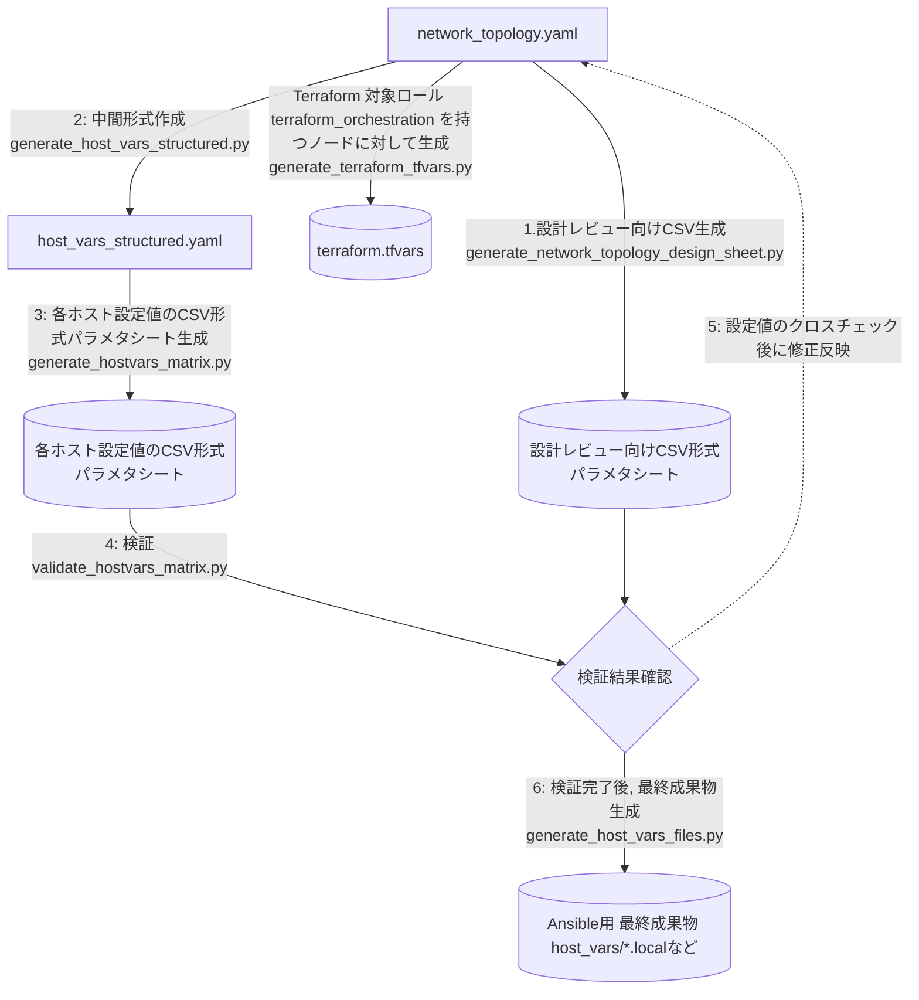

# host_varsファイル生成支援ツールチェーン仕様メモ

## 概要

本ツール群は, ネットワークトポロジ情報から, Ansible向けのホスト変数ファイル群と, 設定値クロスチェック用のCSV形式のパラメタシートを生成する。
加えて, `network_topology.yaml` と `field_metadata.yaml`, スキーマ情報から, 設計レビュー用の4つのCSVデザインシートを生成する。

## 想定ワークフロー



1. **設計レビュー向けCSV形式パラメタシートデザインシート生成**: `network_topology.yaml`, `field_metadata.yaml`, `network_topology.schema.yaml` から4つのCSVデザインシートを生成する (generate_network_topology_design_sheet.py)。
2. **中間形式作成**: `network_topology.yaml` から中間形式 `host_vars_structured.yaml` を生成する (generate_host_vars_structured.py)。
3. **各ホスト設定値のCSV形式パラメタシート生成**: 中間形式からCSV形式のパラメタシートを生成する (generate_hostvars_matrix.py)。
4. **検証**: CSV形式のパラメタシートの妥当性を検証する (validate_hostvars_matrix.py)。
5. **設定値のクロスチェック後に修正反映**: 検証結果を元に設定値をクロスチェックし, 必要に応じて `network_topology.yaml` を修正する (サイクル)。
6. **検証完了後, 最終成果物生成**: 検証完了後に, 中間形式からAnsible向けの個別ホスト変数ファイル (`host_vars/*.local`) を生成する (generate_host_vars_files.py)。
7. **Terraform用設定ファイル生成**: Terraform 対象ロール terraform_orchestration を持つノードに対してTerraform用設定ファイル(`terraform.tfvars`)を生成する(generate_terraform_tfvars.py)。

## ツール一覧と用途

### 1. generate_host_vars_structured.py

**目的**: `network_topology.yaml` を単一の構造化YAML (`host_vars_structured.yaml`) に変換する。

**コマンド**:
```bash
python3 src/prototype/generate_host_vars_structured.py \
  src/prototype/network_topology.yaml \
  src/prototype/host_vars_structured.yaml
```

### 2. generate_hostvars_matrix.py

**目的**: `host_vars_structured.yaml` と `field_metadata.yaml` から, CSV形式のパラメタシート (`host_vars_scalars_matrix.csv`) を生成する。`scalars` 優先 + トップレベル補完で値を取得し, `netif_list` は `netif_list[{IF名}].{sub_field}` 形式の展開行として出力してクロスチェックを支援する。

**コマンド**:
```bash
python3 src/prototype/generate_hostvars_matrix.py \
  -H host_vars_structured.yaml \
  -m field_metadata.yaml \
  -o host_vars_scalars_matrix.csv
```

### 3. validate_hostvars_matrix.py

**目的**: CSV形式のパラメタシートのフォーマットと構造整合性を検証する。固定列ヘッダー, メタデータ行の欠落/余剰, `netif_list[*].*` 展開行の件数整合性, ホスト列の一致を確認する。

**コマンド**:
```bash
python3 src/prototype/validate_hostvars_matrix.py \
  -c host_vars_scalars_matrix.csv \
  -m field_metadata.yaml \
  -H host_vars_structured.yaml
```

### 4. generate_host_vars_files.py

**目的**: `host_vars_structured.yaml` から, Ansible向けの個別ホスト変数ファイル (`host_vars/*.local`) を生成する。各項目の直前に `field_metadata.yaml` の説明コメントを挿入する。検証完了後に実行し, 最終成果物として出力する。

**コマンド**:
```bash
python3 src/prototype/generate_host_vars_files.py \
  <output_dir> \
  -i host_vars_structured.yaml \
  -m field_metadata.yaml \
  -w true \
  -v false
```

### 5. generate_terraform_tfvars.py

**目的**: `network_topology.yaml` から, XCP-ng 仮想化環境向けの Terraform 変数ファイル (`terraform.tfvars`) を HCL 形式で生成する。上記, 1. から 4. の Ansible 向けツールチェインとは独立して動作する。

**デフォルト値を使用する場合**:
カレントディレクトリに `network_topology.yaml` が存在する場合, デフォルト値を使用して以下のように実行する:

```bash
python3 src/prototype/generate_terraform_tfvars.py
```

**ファイルを明示指定する場合**:
```bash
python3 src/prototype/generate_terraform_tfvars.py \
  -t src/prototype/network_topology.yaml \
  -o terraform.tfvars
```

### 6. generate_network_topology_design_sheet.py

**目的**: `network_topology.yaml`, `field_metadata.yaml`, `network_topology.schema.yaml` を読み込み, globals設定, role設定, service設定, ホスト別設定の4つの独立したCSVファイルを生成する。description は `field_metadata.yaml` を優先して参照し, 未定義の場合はスキーマから参照する。未定義の項目は警告を出力し, CSVの description 列は空欄で継続する。

**デフォルト値を使用する場合**:
カレントディレクトリに `network_topology.yaml` が存在する場合, デフォルト値を使用して以下のように実行する:
```bash
python3 src/prototype/generate_network_topology_design_sheet.py
```

**ファイルを明示指定する場合**:
```bash
python3 src/prototype/generate_network_topology_design_sheet.py \
  -i src/prototype/network_topology.yaml \
  -m src/prototype/network_topology.schema.yaml \
  -o network_topology
```

上記の実行により, 以下の4ファイルが `network_topology-globals.csv`, `network_topology-roles.csv`, `network_topology-services.csv`, `network_topology-hosts.csv` として出力される。

---

## generate_host_vars_structured.py 詳細仕様

以下は, ツール(1) `generate_host_vars_structured.py` の詳細仕様である。

## 入力仕様

### トップレベル

- `version` (必須, integer, 最小値: 2)
- `globals` (必須)
- `nodes` (必須, array)

### globals

- `networks` (必須)
- `datacenters` (必須)
- `roles` (任意)
- `services` (任意)
- `scalars` (任意)
- `auto_meshed_ebgp_transport_enabled` (任意, bool, 既定値: true)
- `generate_internal_network_list` (任意, bool, 既定値: true)
- `reserved_nic_pairs` (任意, 2要素配列の配列)

### nodes

各ノードの必須キー:

- `name`
- `hostname_fqdn`
- `roles` (ロールの配列)
- `interfaces`

## 出力仕様

```yaml
hosts:
  - hostname: <string>
    scalars: <dict>
    netif_list: <list>
    k8s_bgp: <object>
    k8s_worker_frr: <object>
    frr_ebgp_neighbors: <list>
    frr_ebgp_neighbors_v6: <list>
    frr_ibgp_neighbors: <list>
    frr_ibgp_neighbors_v6: <list>
    frr_networks_v4: <list>
    frr_networks_v6: <list>
    vcinstances_clusterversions: <list>
    vcinstances_virtualclusters: <list>
```

出力ルール:

- `hostname` は常に出力する(hostnameには, Fully Qualified Domain Name (FQDN)形式でホスト名を指定されることを前提とする)。
- `scalars` は空でなければ出力する。
- `netif_list` は空でなければ出力する。
- `route_reflector` ノードでは, `frr_ibgp_neighbors` と `frr_ibgp_neighbors_v6` を必ず出力する。
  - ネイバーが無い場合は空配列 `[]` を出力する。
- `k8s_control_plane`, `k8s_worker` ノードは, iBGPネイバーを内部計算するが, 出力には含めない。
- `k8s_bgp` は, `k8s_control_plane`, `k8s_worker` ノードを対象とする。入力定義があればその値をそのまま出力し, 未定義なら既定値を自動生成する。
- `k8s_worker_frr` は, `k8s_worker` ノードで入力定義があればその値をそのまま出力し, 未定義なら既定値を自動生成する。
  - `advertise_host_route_ipv4` / `advertise_host_route_ipv6` は, 入力に定義がある場合はその値を使用し, 未定義の場合のみワーカーノードのKubernetes IFアドレスから自動算出して出力する。
- `vcinstances_clusterversions`, `vcinstances_virtualclusters` は, ノード入力にある場合のみ値をそのまま出力する。

## 変換ルール

### 1. ノードマップ

`nodes` から `{name: node}` の辞書を構築する。

### 2. scalars 生成

- 入力ノードの `scalars` を基礎にする。
- NIC自動導出結果を `scalars` に追加する。

#### NIC自動導出

- `mgmt_nic`
  - `external_control_plane_network` のIFがあればその `netif`。
  - 無ければ `private_control_plane_network` の `netif`。
  - 両方無ければエラー。
- `gpm_mgmt_nic`
  - `external_control_plane_network` と `private_control_plane_network` の両方がある場合のみ設定。
- Kubernetesノード (`k8s_control_plane`, `k8s_worker`)
  - `k8s_nic`: `role=data_plane_network` のIFがあれば設定。
  - `k8s_kubelet_nic`: `mgmt_nic` を設定。

#### reserved_nic_pairs 検証

- `gpm_mgmt_nic` がある場合:
  - `(mgmt_nic, gpm_mgmt_nic)` が `reserved_nic_pairs` のいずれかと一致する必要がある。
- `gpm_mgmt_nic` が無い場合:
  - `mgmt_nic` が `reserved_nic_pairs` の要素集合に含まれる必要がある。
- 条件不一致時は `ValueError` を送出する。

### 3. netif_list 生成

各interfaceから `netif_list` 要素を生成する。

基本項目:

- `netif` (必須)
- `mac` (存在時)
- `static_ipv4_addr` (存在時)
- `static_ipv6_addr` (存在時)
- `network_ipv4_prefix_len` (`static_ipv4_addr` と `network.ipv4_cidr` がある場合)
- `network_ipv6_prefix_len` (`static_ipv6_addr` と `network.ipv6_cidr` がある場合)

#### ゲートウェイ決定順

IPv4/IPv6とも同じ優先順位:

1. `interface.gateway4/6`
2. `role=private_control_plane_network` かつノードが `external_control_plane_network` 未接続の場合のみ `gateway_node` 解決値
3. `role=external_control_plane_network` の場合のみ `network.gateway4/6`
4. それ以外は未設定

#### DNSとメトリック

- `dns_search`: interface優先, 次にnetwork既定値
- `name_server_ipv4_1/2`, `name_server_ipv6_1/2`
  - interfaceにあればそれを使用
  - なければ `name_servers_ipv4/ipv6` 配列から補完
- `ignore_auto_ipv4_dns`, `ignore_auto_ipv6_dns`: interface優先, 次にnetwork既定値
- `route_metric_ipv4`, `route_metric_ipv6`: interface優先, 次にnetwork既定値

### 4. FRR関連自動生成

#### eBGPネイバー (`frr_ebgp_neighbors`, `frr_ebgp_neighbors_v6`)

- 対象: 自ノードが所属DCの `route_reflector` の場合のみ。
- 相手: 他DCの `route_reflector` ノード。
- 収集元: 相手ノードの `role=bgp_transport_network` IF。
- 要素形式:
  - `addr`
  - `asn` (相手DCのASN)
  - `desc` (`AS Number: <asn> - <node_name>`)

#### Kubernetes iBGPネイバー (`frr_ibgp_neighbors`, `frr_ibgp_neighbors_v6`)

- ルートリフレクタノード:
  - `k8s_control_plane` ノードとその `control_plane` 参照を持つ `k8s_worker` ノードからクラスタ所属を導出し, 同一DCのメンバーを収集する。
- `k8s_control_plane` ノード:
  - 所属DCの `route_reflector` を内部計算するが, `frr_ibgp_neighbors` / `frr_ibgp_neighbors_v6` としては出力しない。
  - Cilium BGP Control Plane向け設定は `k8s_bgp` キーで出力する。
  - `k8s_bgp` が未定義の場合は, 既定値 (`enabled: false`) をベースに, 所属DCの `route_reflector` と同一クラスタの `k8s_worker` を `neighbors` に含めて自動生成する。
- `k8s_worker` ノード:
  - 所属DCの `route_reflector` を内部計算するが, `frr_ibgp_neighbors` / `frr_ibgp_neighbors_v6` としては出力しない。
  - `k8s_bgp` が未定義の場合は, 所属DCの `route_reflector` を `neighbors` に含む値を自動生成する。
  - `k8s_worker_frr` が未定義の場合は, 所属DCの `route_reflector` を `dc_frr_addresses` / `dc_frr_addresses_v6` に含む値を自動生成する。
  - `advertise_host_route_ipv4` / `advertise_host_route_ipv6` は, `k8s_worker_frr` に入力がある場合はその値を使用し, 未指定時のみワーカーノード自身のKubernetes IFアドレスから自動算出して出力する。
  - `prefix_filter` と `clusters` は, `k8s_worker_frr` の入力にある値をそのまま出力する。

#### FRR広告ネットワーク (`frr_networks_v4`, `frr_networks_v6`)

- 対象: 自ノードが `route_reflector` の場合のみ。
- 収集元:
  - 同一データセンタ所属ノードが接続するネットワークのうち,
    `external_control_plane_network`, `private_control_plane_network`, `data_plane_network`, `bgp_transport_network` のロールを持つネットワーク

### 5. 入力値をそのまま出力する項目と自動生成項目

ノード入力に存在する場合のみ, そのまま出力する。

- `vcinstances_clusterversions`
- `vcinstances_virtualclusters`

補足:

- `k8s_bgp` は `k8s_control_plane`, `k8s_worker` ノードで扱う。入力がある場合はその値を優先し, 未指定時のみ自動生成する。
- `k8s_bgp` の自動生成時は `enabled: false` を既定値とする。
- `k8s_worker_frr` の `advertise_host_route_ipv4` / `advertise_host_route_ipv6` は, 入力値を優先し, 未指定時のみ自動算出値を適用する。

## エラー条件

主なエラー条件:

- 管理IFが見つからない。
- `reserved_nic_pairs` 制約違反。
- 入出力ファイルの読み書き失敗。
- YAMLパース失敗。

## 出力フォーマット設定

`generate_host_vars_structured.py` のYAML出力設定:

- `allow_unicode=True`
- `default_flow_style=False`
- `sort_keys=False`

---

## generate_terraform_tfvars.py 詳細仕様

### 入力仕様

`generate_host_vars_structured.py` と同じ `network_topology.yaml` を入力とする。
Terraform 生成に必要な追加フィールドを以下に示す。

#### globals.roles (Terraform 関連)

- `terraform_orchestration: []` (Terraform 対象ロール, 本ロールを持つノードに対して生成)

#### globals.services.xcp_ng_environment.config

- `xoa_url` (必須, string)
- `xoa_username` (必須, string)
- `xoa_password`: 環境変数 `TF_VAR_xoa_password` で指定 (設定ファイルには記載しない)
- `xoa_insecure` (オプション, bool)
- `xcpng_pool_name` (必須, string)
- `xcpng_sr_name` (必須, string)
- `xcpng_template_ubuntu` (必須, string)
- `xcpng_template_rhel` (必須, string)
- `xcpng_vm_vcpus` (オプション, integer)
- `xcpng_vm_mem_mb` (オプション, integer)
- `xcpng_vm_disk_gb` (オプション, integer)
- `network_key_map` (必須, object): topology ネットワークキー => Terraform 通常ネットワークキー変換マップ
- `network_names` (必須, object): Terraform ネットワークキー => 表示名マップ
- `network_roles` (オプション, object): ネットワーク役割 => Terraform 通常ネットワークキー配列マップ (生成時に自動構築)
- `network_options` (オプション, object): ネットワーク追加オプション
- `vm_group_map` (必須, object): ロール名 => VM グループ名変換マップ
- `vm_group_defaults` (必須, object): VM グループごとのデフォルト設定

#### nodes 各要素の追加フィールド

- `roles` (推奨, 配列): `terraform_orchestration` を含めることで Terraform 生成対象となる
- `services.vm_params.config` (必須):
  - `vm_group` (オプション): VM グループ名の明示指定
  - `template_type` (必須): `ubuntu` または `rhel`
  - `firmware` (必須): `uefi` または `bios`
  - `resource_profile` (オプション)
  - `vcpus`, `memory_mb`, `disk_gb` (オプション): グループ既定値, グローバル既定値を上書き

### 出力仕様

HashiCorp Configuration Language (HCL) 形式の `terraform.tfvars` ファイル。

トップレベル変数:

- `xoa_url`, `xoa_username`, `xoa_insecure` (`xoa_password` は出力しない, `TF_VAR_xoa_password` 環境変数で指定)
- `xcpng_pool_name`, `xcpng_sr_name`
- `xcpng_template_ubuntu`, `xcpng_template_rhel`
- `xcpng_vm_vcpus`, `xcpng_vm_mem_mb`, `xcpng_vm_disk_gb`
- `network_names` (map(string))
- `network_roles` (map(list(string)))
- `network_options` (map(any))
- `vm_group_defaults` (map(object))
- `vm_groups` (map(map(object))): グループ別 VM 定義

`vm_groups` 構造:

```hcl
vm_groups = {
  "<group>" = {
    "<vm_name>" = {
      template_type    = "ubuntu"
      firmware         = "uefi"
      resource_profile = "standard"  # optional
      networks = [
        {
          network_key = "ext_mgmt"
          mac_address = "00:50:56:00:b8:e1"
        },
        ...
      ]
    }
  }
}
```

### 変換ルール

#### 1. 対象ノード抽出

`globals.roles` に `terraform_orchestration` キーが定義されている場合, そのロールを持つノードを抽出する。

- `node.roles` (配列形式): `"terraform_orchestration"` が含まれるか確認

#### 2. VM グループ決定

1. `node.services.vm_params.config.vm_group` が明示指定されていればそれを使用
2. 未指定の場合は `vm_group_map` でノードのロールを変換してグループ名を決定
3. どちらの方法でも決定できない場合はエラー

#### 3. ネットワーク変換

`node.interfaces` の各要素の `network` キーを `network_key_map` で変換する。
変換マップに存在しないキーはエラーとして扱う。
変換後のキーを `network_key` として, インターフェースの `mac` を `mac_address` として出力する。

#### 3.1 network_roles の生成

`globals.networks` の各 network の `role` から `network_roles` を生成する。
このとき, `globals.networks` 側に存在する network 名が `network_key_map` に未登録の場合は,
`network_roles` の集約結果に含めない (エラーにはしない)。

#### 4. VM プロパティ解決順序

`template_type`, `firmware`, `resource_profile` の各プロパティは以下の優先順で決定する:

1. `node.services.vm_params.config.<property>`
2. `vm_group_defaults.<group>.default_<property>`

### エラー条件

- `xcp_ng_environment.config` の必須キー欠落
- VM グループが決定できないノードの存在
- 入出力ファイルの読み書き失敗
- YAML パース失敗

---

## generate_network_topology_design_sheet.py 詳細仕様

### 入力仕様

- `network_topology.yaml`
  - 必須トップレベルキー: `version`, `globals`, `nodes`
- `field_metadata.yaml` (オプション, 入力ファイルと同じディレクトリから自動検索)
  - `design_sheet_descriptions` セクションを description の優先解決元として使用する
- `network_topology.schema.yaml`
  - description のフォールバック解決元として使用する

### 出力仕様

出力は, 4つの独立した CSV ファイルである。

各ファイル名は入力ファイルのベース名 (`{input_stem}`) から自動決定される。`-o` オプションはディレクトリまたはパスのヒントとして扱われる:

1. `{input_stem}-globals.csv` - globals 設定セクション
2. `{input_stem}-roles.csv` - role 設定セクション
3. `{input_stem}-services.csv` - service 設定セクション
4. `{input_stem}-hosts.csv` - ホスト別設定セクション

globals / roles / services の各ファイルは以下の4列である。

- `item`
- `parameter`
- `description`
- `value`

hosts ファイルはホスト別列形式である。

- `parameter` (行種別とパラメータ名を `.` で連結した識別子, 例: `host_scalar.scalars.frr_bgp_asn`)
- `description`
- `{hostname_1}`, `{hostname_2}`, ... (ホスト名ごとの値列)

各ファイルの1行目はヘッダー行 (列名) である。

### 変換ルール

1. `globals`
   - `globals.networks`, `globals.datacenters`, `globals.scalars` を中心に出力する。
   - `{input_stem}-globals.csv` に出力される。
2. `roles`
   - `globals.roles.<role>` を `service_list` として出力する。
   - `{input_stem}-roles.csv` に出力される。
3. `services`
   - `globals.services.<service>.enabled` と `config` を再帰展開して出力する。
   - `config` が空オブジェクトの場合は `parameter=config`, `value=空欄` の行を出力する。
   - `{input_stem}-services.csv` に出力される。
4. `hosts`
   - `nodes[*]` から `host_node`, `host_interface`, `host_scalar`, `host_service` を出力する。
   - `{input_stem}-hosts.csv` に出力される。

### description 解決ルール

description は以下の優先順で解決する。

1. `field_metadata.yaml` の `design_sheet_descriptions` セクションの個別エントリを参照する (メタデータ優先)。
2. `field_metadata.yaml` の `fields` セクションからワイルドカードキーで一致するエントリを参照する。
3. `network_topology.schema.yaml` の `description` をフォールバックとして参照する。
   - 実データパスはワイルドカード化してスキーマパスへ正規化する。
   - 例: `nodes[3].interfaces[0].netif` -> `nodes.*.interfaces.*.netif`
4. 解決できない場合:
   - CSVの `description` 列は空欄にする。
   - 標準エラーへ `Warning: missing description for <data_path>` を出力する。
   - 処理は継続する。

### エラー条件

- 入力ファイル不存在
- YAML パース失敗
- 必須トップレベルキー欠落
- 期待型不一致
- 出力ディレクトリ作成失敗

### 終了コード

- 0: 正常終了 (description 欠落警告のみの場合を含む)
- 1: エラー終了
