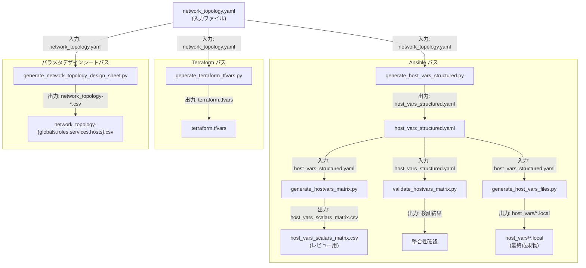

# ツールチェイン概要

提供するツールチェインの概要, ツール群の目的, 全体像について説明します。

## 目次

- [ツールチェイン概要](#ツールチェイン概要)
  - [目次](#目次)
  - [本ツール群の目的](#本ツール群の目的)
  - [ツールチェイン全体像](#ツールチェイン全体像)
  - [各ツールの役割](#各ツールの役割)
  - [各ツールの入力と出力](#各ツールの入力と出力)
    - [generate\_host\_vars\_structured.py](#generate_host_vars_structuredpy)
    - [generate\_hostvars\_matrix.py](#generate_hostvars_matrixpy)
    - [validate\_hostvars\_matrix.py](#validate_hostvars_matrixpy)
    - [generate\_host\_vars\_files.py](#generate_host_vars_filespy)
    - [generate\_terraform\_tfvars.py](#generate_terraform_tfvarspy)
    - [generate\_network\_topology\_design\_sheet.py](#generate_network_topology_design_sheetpy)
  - [標準処理フロー](#標準処理フロー)
  - [Terraform 出力の位置付け](#terraform-出力の位置付け)
  - [パラメタデザインシート出力の位置付け](#パラメタデザインシート出力の位置付け)
  - [入力ファイルと出力ファイル](#入力ファイルと出力ファイル)
    - [入力ファイル](#入力ファイル)
    - [出力ファイル](#出力ファイル)
  - [スキーマと設定ファイルの探索順](#スキーマと設定ファイルの探索順)
  - [設定ファイル形式 (schema\_search\_paths)](#設定ファイル形式-schema_search_paths)
  - [関連ファイル一覧](#関連ファイル一覧)
  - [関連文書](#関連文書)


## 本ツール群の目的

ansibleConfigGenerator は, ネットワークトポロジー定義ファイル (`network_topology.yaml`) を入口として, [ansible-linux-setup](https://github.com/takeharukato/ansible-linux-setup) で使用する Ansible ホスト変数ファイル群と, インフラ構築に必要な Terraform 設定ファイルを自動生成するツールキットです。

手作業でホスト変数を管理する代わりに, データセンター内の各ノードの提供機能やネットワークトポロジー定義を一元管理し, そこから各出力ファイルを再生成する運用を実現します。

## ツールチェイン全体像

本ツール群には 3 本の処理経路があります。



## 各ツールの役割

| ツール名 | 役割 |
|---|---|
| [generate_host_vars_structured.py](generate-host-vars-structured.md) | `network_topology.yaml` を検証し, 構造化 host_vars を生成する (Ansible パスの起点) |
| [generate_hostvars_matrix.py](generate-hostvars-matrix.md) | 構造化 host_vars から設定値一覧 Comma-Separated Values (以下 CSV と略す) を生成する (レビュー用) |
| [validate_hostvars_matrix.py](validate-hostvars-matrix.md) |  ノード設定パラメタデザインシート の整合性を検証する |
| [generate_host_vars_files.py](generate-host-vars-files.md) | 構造化 host_vars をホスト別の YAML Ain't Markup Language (以下 YAML と略す) ファイルに展開する |
| [generate_terraform_tfvars.py](generate-terraform-tfvars.md) | `network_topology.yaml` から `terraform.tfvars` を生成する |
| [generate_network_topology_design_sheet.py](generate-network-topology-design-sheet.md) | `network_topology.yaml` から パラメタデザインシート を生成する |

## 各ツールの入力と出力

### generate_host_vars_structured.py

| 項目 | 内容 |
|---|---|
| 主入力 | `network_topology.yaml`, `convert-rule-config.yaml` |
| 主出力 | `host_vars_structured.yaml` |
| スキーマ検証 | `network_topology.schema.yaml` |
| 主なオプション | `-i/--input`, `-o/--output`, `--schema-dir` |

```shell
generate_host_vars_structured.py -i network_topology.yaml -o host_vars_structured.yaml
```

### generate_hostvars_matrix.py

| 項目 | 内容 |
|---|---|
| 主入力 | `host_vars_structured.yaml`, `field_metadata.yaml` |
| 主出力 | `host_vars_scalars_matrix.csv` |
| 主なオプション | `-H/--host-vars`, `-m/--metadata`, `-o/--output`, `--schema-dir` |

```shell
generate_hostvars_matrix.py -H host_vars_structured.yaml -m field_metadata.yaml \
  -o host_vars_scalars_matrix.csv
```

### validate_hostvars_matrix.py

| 項目 | 内容 |
|---|---|
| 主入力 | `host_vars_scalars_matrix.csv`, `field_metadata.yaml`, `host_vars_structured.yaml` |
| 主出力 | 検証結果 (終了コード 0 = 成功) |
| 主なオプション | `-c/--csv`, `-m/--metadata`, `-H/--host-vars` |

### generate_host_vars_files.py

| 項目 | 内容 |
|---|---|
| 主入力 | `host_vars_structured.yaml`, `field_metadata.yaml` |
| 主出力 | `{output_dir}/{hostname}.local`, `{output_dir}/main.yml` |
| 主なオプション | `output_dir` (位置引数), `-i/--input-structured`, `-m/--metadata`, `-w/--overwrite`, `-v/--validate-roundtrip` |

### generate_terraform_tfvars.py

| 項目 | 内容 |
|---|---|
| 主入力 | `network_topology.yaml` |
| 主出力 | `terraform.tfvars` (HashiCorp Configuration Language (以下 HCL と略す) 形式) |
| 前提 | topology に `terraform_orchestration` ロールが定義されていること |
| 主なオプション | `-t/--topology`, `-o/--output`, `-n/--dry-run`, `-s/--strict` |

### generate_network_topology_design_sheet.py

| 項目 | 内容 |
|---|---|
| 主入力 | `network_topology.yaml`, `field_metadata.yaml` |
| 主出力 | `network_topology-globals.csv`, `network_topology-roles.csv`, `network_topology-services.csv`, `network_topology-hosts.csv` |
| 主なオプション | `-i/--input`, `-o/--output`, `--schema-dir` |

## 標準処理フロー

Ansible パスの標準的な実行順序は次のとおりです。

| ステップ | コマンド | 入力 | 出力 |
|---|---|---|---|
| 1 | `generate_host_vars_structured.py` | `network_topology.yaml` | `host_vars_structured.yaml` |
| 2 | `generate_hostvars_matrix.py` | `host_vars_structured.yaml` | `host_vars_scalars_matrix.csv` |
| 3 | `validate_hostvars_matrix.py` | ノード設定パラメタデザインシート + `field_metadata.yaml` | 検証結果 |
| 4 | `generate_host_vars_files.py` | `host_vars_structured.yaml` | `host_vars/*.local` |

ステップ 1 の出力がステップ 2 以降の入力となるため, この順序を守ってください。

## Terraform 出力の位置付け

`generate_terraform_tfvars.py` は Xen Cloud Platform next generation (以下 XCP-ng と略す) 環境向けの Terraform 変数ファイルを生成します。Ansible パスとは独立しており, `network_topology.yaml` を入力とします。

topology 内に `terraform_orchestration` ロールを持つノードが定義されている場合に, そのノードの環境設定から `terraform.tfvars` を生成します。

## パラメタデザインシート出力の位置付け

`generate_network_topology_design_sheet.py` は topology の構造を 4 種類の CSV ファイルに展開します。設計レビューや仕様書作成の補助を目的としており, Ansible パスとは独立して使用します。

| 出力ファイル | 内容 |
|---|---|
| `network_topology-globals.csv` | グローバル設定 (ネットワーク, スカラー既定値) |
| `network_topology-roles.csv` | ロールとそれに対応するサービスの一覧 |
| `network_topology-services.csv` | サービス定義と設定値の一覧 |
| `network_topology-hosts.csv` | ホスト別の設定一覧 |

## 入力ファイルと出力ファイル

### 入力ファイル

| ファイル名 | 役割 | 形式 |
|---|---|---|
| `network_topology.yaml` | ネットワーク, ロール, ノードの定義 (主入力) | YAML |
| `field_metadata.yaml` | スカラーフィールドの名称, 型, 制約 | YAML |
| `convert-rule-config.yaml` | サービス設定からスカラーへの変換ルール, ネットワークロールポリシー | YAML |
| `network_topology.schema.yaml` | `network_topology.yaml` の JavaScript Object Notation (以下 JSON と略す) Schema 定義 | YAML |
| `type_schema.yaml` | 出力変数の Python 型マッピング | YAML |

### 出力ファイル

| ファイル名 | 役割 | 形式 |
|---|---|---|
| `host_vars_structured.yaml` | 全ホスト分の構造化 host_vars (中間生成物) | YAML |
| `host_vars_scalars_matrix.csv` | スカラー設定値の一覧表 (レビュー用) | CSV |
| `{output_dir}/{hostname}.local` | ホスト別 Ansible ホスト変数ファイル (最終成果物) | YAML |
| `terraform.tfvars` | XCP-ng 向け Terraform 変数ファイル (最終成果物) | HCL |
| `network_topology-*.csv` | パラメタデザインシート (補助資料) | CSV |

## スキーマと設定ファイルの探索順

各 CLI ツールは, 起動時にスキーマファイルと設定ファイルを次の優先順で探索します。最初に見つかったファイルを使用します。

| 優先順位 | 探索先 | 概要 |
|---|---|---|
| 1 | `--schema-dir` オプション | CLI 実行時に `--schema-dir` で指定したディレクトリ |
| 2 | ユーザー設定 | `~/.genAnsibleConf.yaml` の `schema_search_paths` セクション |
| 3 | システム設定 | `/etc/genAnsibleConf/config.yaml` の `schema_search_paths` セクション |
| 4 | datadir | 環境変数 `$GENANSIBLECONF_SCHEMADIR` または `make install` 時に設定された配置先 |
| 5 | スクリプト配置ディレクトリ | 実行スクリプトと同じディレクトリ (ソースツリーからの直接実行時) |

スキーマ探索先を明示的に指定する場合:

```shell
generate_hostvars_matrix.py --schema-dir /path/to/schema \
  -H host_vars_structured.yaml -m field_metadata.yaml
```

設定ファイル (`~/.genAnsibleConf.yaml`) の `schema_search_paths` に特定のファイルパスを指定することで, ファイルごとに個別のパスを設定できます。詳細は [利用者向け操作ガイド](user-guide-linux-ansible-setup.md) の「スキーマ探索先を変更する場合」を参照してください。

## 設定ファイル形式 (schema_search_paths)

ユーザー設定 (`~/.genAnsibleConf.yaml`) とシステム設定 (`/etc/genAnsibleConf/config.yaml`) では, `schema_search_paths` セクションで各ファイルの探索先を個別指定できます。

`schema_search_paths` の各キー:

| キー名 | 設定する内容 | 設定例 |
|---|---|---|
| `field_metadata` | フィールドメタデータ YAML ファイルのパス | `~/.genAnsibleConf/field_metadata.yaml` |
| `network_topology` | ネットワークトポロジー JSON Schema ファイルのパス | `~/.genAnsibleConf/network_topology.schema.yaml` |
| `type_schema` | 型スキーマ YAML ファイルのパス | `~/.genAnsibleConf/type_schema.yaml` |
| `convert_rule_config` | 変換ルール設定 YAML ファイルのパス | `~/.genAnsibleConf/convert-rule-config.yaml` |
| `default_dir` | 各キーの個別パスが未設定の場合に使用するデフォルトディレクトリ | `~/.genAnsibleConf` |

設定ファイルの例:

```yaml
schema_search_paths:
  field_metadata: ~/.genAnsibleConf/field_metadata.yaml
  network_topology: ~/.genAnsibleConf/network_topology.schema.yaml
  type_schema: ~/.genAnsibleConf/type_schema.yaml
  convert_rule_config: ~/.genAnsibleConf/convert-rule-config.yaml
  default_dir: ~/.genAnsibleConf
```

設定サンプル:

- `config/genAnsibleConf.user-config.yaml`
- `config/genAnsibleConf.system-config.yaml`

## 関連ファイル一覧

| ファイル | リポジトリでの配置 |
|---|---|
| `network_topology.yaml` (サンプル) | `src/genAnsibleConf/network_topology.yaml` |
| `field_metadata.yaml` | `src/genAnsibleConf/field_metadata.yaml` |
| `convert-rule-config.yaml` | `src/genAnsibleConf/convert-rule-config.yaml` |
| `network_topology.schema.yaml` | `src/genAnsibleConf/network_topology.schema.yaml` |
| `host_vars_structured.schema.yaml` | `src/genAnsibleConf/host_vars_structured.schema.yaml` |
| `field_metadata.schema.yaml` | `src/genAnsibleConf/field_metadata.schema.yaml` |
| `type_schema.yaml` | `src/genAnsibleConf/type_schema.yaml` |
| ユーザー設定サンプル | `config/genAnsibleConf.user-config.yaml` |
| システム設定サンプル | `config/genAnsibleConf.system-config.yaml` |

## 関連文書

- [利用者向け操作ガイド](user-guide-linux-ansible-setup.md)
- [ロール作成者向けガイド](ansible-role-author-guide.md)
- [スキーマファイルリファレンスマニュアル](schema-files-reference.md)
- [変換ルール設定リファレンスマニュアル](convert-rule-config-reference.md)
- [フィールドメタデータリファレンスマニュアル](field-metadata-reference.md)
- [docs/commands-specJP.md](../commands-specJP.md) (各コマンドの詳細仕様書)
