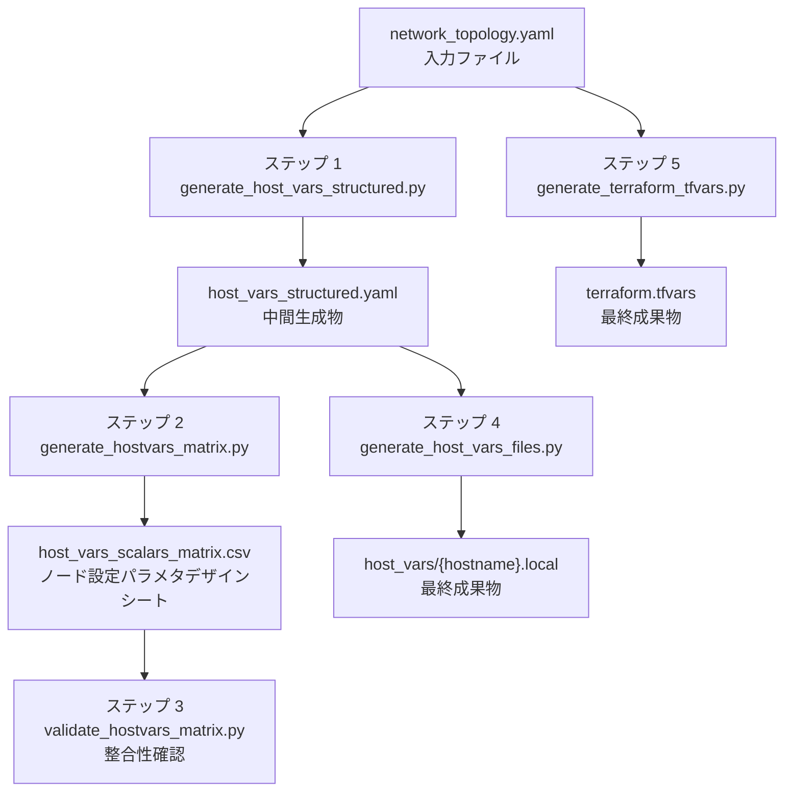

# 利用者向け操作ガイド: ansible-linux-setup 設定ファイルの生成

このガイドは, [ansible-linux-setup](https://github.com/takeharukato/ansible-linux-setup) を使ってサーバ環境を構築する利用者を対象としています。

このガイドでは, 次の最終成果物を生成する手順を説明します。

- `host_vars/{hostname}.local`: Ansible ホスト変数ファイル (ホスト別)
- `terraform.tfvars`: Xen Cloud Platform next generation (以下 XCP-ng と略す) 環境向け Terraform 変数ファイル

## 目次

- [利用者向け操作ガイド: ansible-linux-setup 設定ファイルの生成](#利用者向け操作ガイド-ansible-linux-setup-設定ファイルの生成)
  - [目次](#目次)
  - [生成対象ファイルの全体像](#生成対象ファイルの全体像)
  - [前提条件](#前提条件)
  - [事前に準備するファイル](#事前に準備するファイル)
    - [network\_topology.yaml](#network_topologyyaml)
  - [標準ワークフロー](#標準ワークフロー)
    - [ステップ 1: network\_topology.yaml から host\_vars\_structured.yaml を生成する](#ステップ-1-network_topologyyaml-から-host_vars_structuredyaml-を生成する)
    - [ステップ 2: ノード設定パラメタデザインシートを生成して設定値をレビューする](#ステップ-2-ノード設定パラメタデザインシートを生成して設定値をレビューする)
    - [ステップ 3: ノード設定パラメタデザインシート の整合性を確認する](#ステップ-3-ノード設定パラメタデザインシート-の整合性を確認する)
    - [ステップ 4: host\_vars ファイル群を生成する](#ステップ-4-host_vars-ファイル群を生成する)
    - [ステップ 5: Terraform 設定ファイルを生成する](#ステップ-5-terraform-設定ファイルを生成する)
  - [パラメタデザインシート を併用する場合](#パラメタデザインシート-を併用する場合)
  - [スキーマ探索先を変更する場合](#スキーマ探索先を変更する場合)
    - [方法 1: コマンドラインオプションで指定する](#方法-1-コマンドラインオプションで指定する)
    - [方法 2: ユーザー設定ファイルで指定する](#方法-2-ユーザー設定ファイルで指定する)
  - [生成物の確認ポイント](#生成物の確認ポイント)
    - [host\_vars ファイルの確認観点](#host_vars-ファイルの確認観点)
    - [terraform.tfvars の確認観点](#terraformtfvars-の確認観点)
  - [よくある見直し箇所](#よくある見直し箇所)
  - [関連資料](#関連資料)


## 生成対象ファイルの全体像

下の図は入力ファイルから最終成果物までの流れです。



ノード設定パラメタデザインシート はレビュー用の一覧表です。設定値を修正したい場合は, 元の `network_topology.yaml` を変更してステップ 1 から再生成してください。

## 前提条件

- Python 3.9 以降がインストールされていること
- `make install` を実行済みであること (または Python パスが通っていること)
- `PyYAML`, `jsonschema` パッケージが利用可能なこと

```shell
python3 -m pip install -r requirements.txt
```

## 事前に準備するファイル

### network_topology.yaml

ネットワーク構成, Kubernetes クラスタ構成, ノード一覧を定義する主入力ファイルです。このファイルを自分の環境に合わせて作成します。

ファイルのトップレベルには次のセクションが必要です。

| キー | 内容 | 必須 |
|---|---|---|
| `version` | スキーマバージョン。現在は `2` を指定する | 必須 |
| `globals` | 全ノード共通の設定 (ネットワーク, サービス, スカラー既定値 など) | 必須 |
| `nodes` | ホスト別設定のリスト | 必須 |

`globals` 配下のキー:

| キー | 内容 | 必須 |
|---|---|---|
| `networks` | ネットワークセグメントの定義 | 必須 |
| `datacenters` | データセンタ構造の定義 | 必須 |
| `services` | 全ノード共通のサービス既定値 | 任意 |
| `roles` | ロール名とそのロールが使うサービスのマッピング | 任意 |
| `scalars` | 全ノード共通のスカラー変数既定値 | 任意 |

最小構成の例:

```yaml
version: 2
globals:
  networks:
    mgmt:
      role: external_control_plane_network
      cidr_v4: 192.168.0.0/24
  datacenters:
    dc1:
      clusters: {}
  roles:
    base: []
  scalars:
    k8s_major_minor: "1.31"
nodes:
  - hostname_fqdn: node01.example.local
    roles: [base]
    interfaces:
      - network: mgmt
        ipv4_address: 192.168.0.10
```

詳細な書き方は [スキーマファイル参照](schema-files-reference.md) の `network_topology.schema.yaml` の節を参照してください。

## 標準ワークフロー

### ステップ 1: network_topology.yaml から host_vars_structured.yaml を生成する

`network_topology.yaml` を検証し, すべてのホスト変数を一つのファイルに構造化します。スキーマ違反があればこのステップでエラーが出ます。

```shell
generate_host_vars_structured.py \
  -i network_topology.yaml \
  -o host_vars_structured.yaml
```

**確認ポイント**

- エラーなく完了し, `host_vars_structured.yaml` が生成されること
- `hosts` キーの下にノード数分のエントリがあること

### ステップ 2: ノード設定パラメタデザインシートを生成して設定値をレビューする

すべてのノードのスカラー設定値を一覧表として出力します。スプレッドシートで開いてノード間の比較や設定値の確認に使います。

```shell
generate_hostvars_matrix.py \
  -H host_vars_structured.yaml \
  -m field_metadata.yaml \
  -o host_vars_scalars_matrix.csv
```

ノード設定パラメタデザインシート の列構成:

| 列 | 内容 |
|---|---|
| 1 列目 | パラメータ名 (スカラーキー名または `netif_list[{IF名}].*` 形式) |
| 2 列目 | パラメータの説明 |
| 3 列目 | 制約情報 (`allowed_range` の内容) |
| 4 列目以降 | 各ホストの設定値 |

**レビュー時の確認ポイント**

- 各ホストの IP アドレスや ASN が意図通りに設定されていること
- К8s クラスタに属するノードに `k8s_major_minor` などの値が正しく伝搬していること
- サービス有効フラグ (例: `k8s_helm_enabled`) が対象ノードだけ `true` になっていること

設定値に誤りがあった場合は, `network_topology.yaml` を修正してステップ 1 から再実行してください。

### ステップ 3: ノード設定パラメタデザインシート の整合性を確認する

生成した ノード設定パラメタデザインシート のフォーマットと, スキーマ定義との整合性を検証します。

```shell
validate_hostvars_matrix.py \
  host_vars_scalars_matrix.csv \
  field_metadata.yaml \
  host_vars_structured.yaml
```

このコマンドが正常終了 (終了コード 0) すれば, ノード設定パラメタデザインシート の構造は問題ありません。

**validate_hostvars_matrix.py が確認する内容**

- ノード設定パラメタデザインシート のヘッダー行の列数がノード数と一致していること
- `netif_list` の展開行数が実ノードの Network Interface Card (以下 NIC と略す) 数と一致していること
- `allowed_range` の形式が `field_metadata.yaml` の定義に沿っていること

### ステップ 4: host_vars ファイル群を生成する

`host_vars_structured.yaml` からホスト別の YAML Ain't Markup Language (以下 YAML と略す) ファイルを生成します。`-v` オプションでラウンドトリップ検証 (生成直後に再読み込みして値が変化しないことを確認) も実施できます。

```shell
generate_host_vars_files.py \
  host_vars.gen \
  -i host_vars_structured.yaml \
  -m field_metadata.yaml \
  -v true
```

`host_vars.gen/` 配下に次のファイルが生成されます。

| ファイル | 内容 |
|---|---|
| `{hostname}.local` | ホスト別の Ansible ホスト変数 (スカラー + ネットワーク変数を含む YAML) |
| `main.yml` | `host_vars` の共通エントリポイント |

生成された `.local` ファイルには `field_metadata.yaml` の `description` がコメントとして挿入されます。

**ラウンドトリップ検証について**

`-v true` を指定すると, 生成した YAML ファイルを再読み込みして元の値と一致することを確認します。型の誤り (数値が文字列として書き出されるなど) を早期に検出できます。検証に失敗した場合は [トラブルシューティング](troubleshooting.md) を参照してください。

### ステップ 5: Terraform 設定ファイルを生成する

XCP-ng 環境向けの `terraform.tfvars` を生成します。このステップは Ansible パスと独立しており, ステップ 1 の完了を待たずに実行できます。

```shell
generate_terraform_tfvars.py \
  -t network_topology.yaml \
  -o terraform.tfvars
```

`network_topology.yaml` に `terraform_orchestration` ロールが定義されていること, および関連するサービス設定 (`xcp_ng_environment`) が存在することが前提です。

## パラメタデザインシート を併用する場合

topology の構造を設計書として出力したい場合は, 次のコマンドを使います。Ansible パスとは独立して実行できます。

```shell
generate_network_topology_design_sheet.py \
  -i network_topology.yaml \
  -o ./design_sheets/
```

`design_sheets/` 以下に 4 種類の CSV ファイルが生成されます。詳細は [ツールチェイン概要](toolchain-overview.md) の「パラメタデザインシート出力の位置付け」を参照してください。

## スキーマ探索先を変更する場合

スキーマファイルやメタデータファイルを標準の配置先以外に置きたい場合は, 次のいずれかの方法で指定します。

### 方法 1: コマンドラインオプションで指定する

```shell
generate_host_vars_structured.py \
  --schema-dir /path/to/my/schema \
  -i network_topology.yaml \
  -o host_vars_structured.yaml
```

### 方法 2: ユーザー設定ファイルで指定する

`~/.genAnsibleConf.yaml` を作成し, `schema_search_paths` セクションにパスを記述します。

| キー | 設定する内容 | 例 |
|---|---|---|
| `field_metadata` | `field_metadata.yaml` のパス | `~/.genAnsibleConf/field_metadata.yaml` |
| `network_topology` | `network_topology.schema.yaml` のパス | `~/.genAnsibleConf/network_topology.schema.yaml` |
| `type_schema` | `type_schema.yaml` のパス | `~/.genAnsibleConf/type_schema.yaml` |
| `convert_rule_config` | `convert-rule-config.yaml` のパス | `~/.genAnsibleConf/convert-rule-config.yaml` |
| `default_dir` | 上記キーが未設定の場合に使うディレクトリ | `~/.genAnsibleConf/` |

```yaml
schema_search_paths:
  field_metadata: ~/.genAnsibleConf/field_metadata.yaml
  network_topology: ~/.genAnsibleConf/network_topology.schema.yaml
  type_schema: ~/.genAnsibleConf/type_schema.yaml
  convert_rule_config: ~/.genAnsibleConf/convert-rule-config.yaml
  default_dir: ~/.genAnsibleConf
```

探索順の詳細は [ツールチェイン概要](toolchain-overview.md) の「スキーマと設定ファイルの探索順」を参照してください。

## 生成物の確認ポイント

### host_vars ファイルの確認観点

- `netif_list` に正しい NIC 名と IP アドレスが入っていること
- `mgmt_nic`, `k8s_nic` などの管理 NIC 変数が期待するインターフェースを指していること
- K8s ノードに `k8s_bgp`, `k8s_worker_frr` などが生成されていること (K8s 構成の場合)
- Free Range Routing (以下 FRR と略す) 構成ノードに `frr_ebgp_neighbors`, `frr_networks_v4` などが生成されていること

### terraform.tfvars の確認観点

- `network_names` に定義したネットワーク名が含まれていること
- `vm_groups` に対象ノードのグループが含まれていること
- XCP-ng 接続情報 (`xoa_url` など) が正しく設定されていること

## よくある見直し箇所

| 現象 | 見直し箇所 |
|---|---|
| 特定ノードでサービスのスカラーが生成されない | `network_topology.yaml` でそのノードに対象サービスのロールが割り当てられていることを確認する |
| `k8s_nic` が期待しない NIC を指している | `globals.networks` の `role` が `data_plane_network` になっていることを確認する |
| `mgmt_nic` が空 | `globals.networks` の `role` が `external_control_plane_network` のネットワークにノードが接続されていることを確認する |
| ノード設定パラメタデザインシート レビューで空欄のセルがある | そのノードでそのサービスが無効になっている (設計通りであれば問題なし) |
| terraform.tfvars が空または不完全 | `terraform_orchestration` ロールおよび `xcp_ng_environment` サービス設定が定義されていることを確認する |

## 関連資料

- [ツールチェイン概要](toolchain-overview.md)
- [トラブルシューティング](troubleshooting.md)
- [フィールドメタデータ参照](field-metadata-reference.md)
- [変換ルール設定参照](convert-rule-config-reference.md)
- [スキーマファイル参照](schema-files-reference.md)
